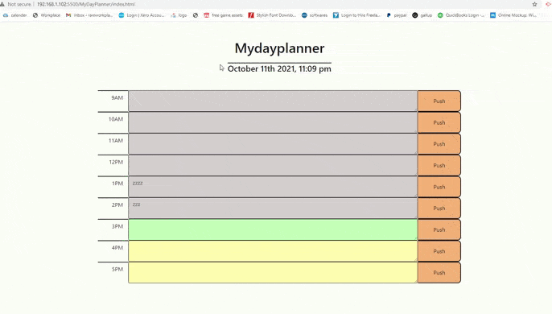

# MyDayPlanner

## About The Project

This project is to create a daily planner. When the page is loaded, you will see today's date on the header and will also see the input textboxes so users can add notes and submit them. The text is disabled if the time is passed and the and text box is greyed-out. The current time is presented in green color, and the future time is presented in yellow color.
On clicking the push button, the to-do list is stored in local storage, and when the browser is refreshed, it is retrieved from local storage.

## Technologies used

- html
- css
- java script

## functionality 
- user need to click on the button to store to-do list 

## Development process

- HTML and CSS pages are created
- added styling
- added comments to HTML and CSS
- worked on past, present, and future time change using JavaScript
- worked on added data to local storage

## The following appearance of the site:

# URL of the website

https://rammohanmiryala.github.io/MyDayPlanner/
